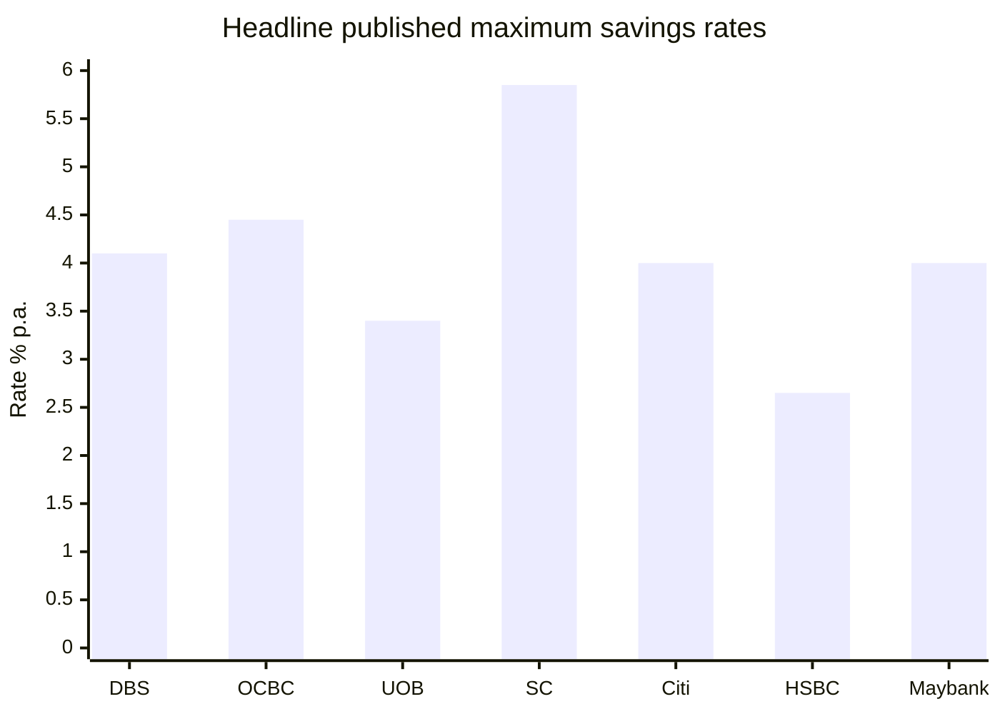
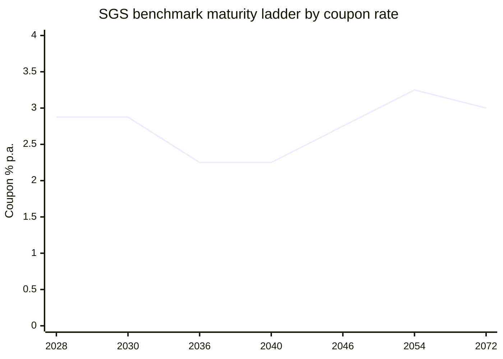

# Singapore Banking and Investment Research Report

*Data timestamp:* 2026-06-03 SGT, unless a source page or factsheet states a different effective, print, or valuation date. All monetary figures are in SGD unless otherwise noted.

## Executive summary

The retail-banking picture in Singapore is still dominated by conditional “engagement” savings accounts rather than true plain-vanilla savings rates. On a mass-market basis, the highest currently published headline rates in the seven-bank set are Standard Chartered Bonus$aver at up to **5.85% p.a.** on the first S$100,000 from 1 May 2026, OCBC 360 at up to **4.45% p.a.** on the first S$100,000 from 1 May 2026, DBS Multiplier at up to **4.10% p.a.** on the first S$100,000, Citi Interest Booster at up to **4.00% p.a.** on the first S$50,000, and Maybank SaveUp at a **4.00% top-tier slice rate** but only a **3.08% maximum effective rate** on the first S$75,000. UOB One still markets up to **3.40% p.a.** on the top savings tier, but the bank’s own effective-rate framing implies a maximum account-level yield of **1.90% p.a.** on S$150,000. HSBC Everyday Global Account’s current SGD stack is **2.65% p.a.** on eligible incremental balances for customers with wealth holdings during the June 2026 promotion period. citeturn22view3turn22view1turn22view0turn26search1turn24view0turn28view0turn22view2turn25view0

That headline comparison needs context. Many of the “best” rates require salary crediting, cards spend, insurance or investment purchases, fresh-funds registration, or mortgage relationships. Wealth-tier variants can go even higher, but they are not apples-to-apples with ordinary retail accounts: Citi also markets Wealth First at up to **7.51% p.a.**, while Maybank’s Privilege and Premier Save Up variants advertise up to **7%** and **8%** respectively, each tied to wealth-segment relationships and broader product holding. citeturn23search1turn26search5turn27search2turn27search1

On investments, the clearest bank-affiliated ETF ecosystems in the public Singapore pages reviewed belong to the OCBC and UOB groups through Lion Global Investors and UOB Asset Management. DBS stands out not for in-house listed ETFs but for bank-curated ETF portfolios under digiPortfolio and CIO Insights Funds. HSBC distributes an HSBC Asset Management ETF range globally, but the Singapore public page reviewed did not expose enough product-level metrics in parsed text for a like-for-like bank table. Standard Chartered Singapore and Citibank Singapore clearly distribute funds and ETFs through open-architecture wealth platforms and brokerage, but a directly bank-managed Singapore retail ETF did not surface in the public pages reviewed in this session. citeturn41search2turn41search1turn17view1turn18view0turn15view3turn12search5turn12search7

For mortgages, the lowest clearly published mainstream floating spreads in the pages reviewed were Maybank’s **3M Compounded SORA + 0.70%** for completed residential properties and UOB’s **3M Compounded SORA + 0.70%** for Years 1–2 on its direct-to-bank package. Citibank’s public mortgage PDF was even sharper for Citigold customers at **1M Compounded SORA + 0.45%** in Years 1–2, but that is relationship-tiered. Standard Chartered’s public SORA package is materially wider at **3M Compounded SORA + 1.00%** throughout. DBS’ most aggressive public spread in the material reviewed was its **Green Home Loan** at **3M SORA + 0.28%** in Years 1–2, but that is narrowly scoped to Green Mark-certified new-launch properties and requires at least S$1,000,000 borrowing. citeturn30view4turn30view3turn34view0turn35view0turn30view2turn30view1

For Singapore bonds, MAS’ official pages remain the strongest primary source. The benchmark SGS ladder available in the MAS statistics pages spans current benchmarks from around the short end out to **50 years**, and MAS’ daily tables show live benchmark prices and yields for SGS and T-bills. In the parsed session, one short-end T-bill example surfaced directly: issue **BS25124F** maturing **9 Jun 2026** with a **1.34% yield** and **99.96 price**. The browser text did not reliably expose all live benchmark-yield cells for the full SGS curve, so the government-bond section below is strongest on the benchmark ladder and official data locations, and weaker on a full same-day numeric yield curve. citeturn43view1turn42search6turn42search15turn42search13

## Savings accounts and deposit rates

The most decision-useful comparison for ordinary retail clients is the banks’ flagship consumer savings/current accounts rather than passbook accounts, because that is where the current conditional rates sit. Plain passbook rates remain very low in the limited product pages that surfaced cleanly, such as Citi MaxiSave at **0.01%**, HSBC passbook/savings at **0.01%**, and Maybank passbook savings at **0.05% / 0.15% / 0.20%** by balance tier. citeturn24view0turn24view2turn24view4

| Bank | Flagship retail savings account | Base / prevailing rate | Promotional or bonus structure | Published max total rate or EIR | Key cap and conditions | Effective date on source | Source |
|---|---|---:|---|---:|---|---|---|
| DBS / POSB | **DBS Multiplier** | Base interest applies if criteria are unmet, but the numeric base rate was not exposed in the parsed rates page | Bonus rate determined by monthly eligible transactions with DBS/POSB | **Up to 4.10% p.a.** | Bonus applies only up to the **first S$100,000** | Current page viewed 2026-06-03 | citeturn22view0turn21search0 |
| OCBC | **OCBC 360** | **0.05% p.a.** | Salary + Save = 1.70% EIR; Salary + Save + Spend = 1.95%; add Insure or Invest = 3.20%; all five = 4.45% | **4.45% EIR** | Applies to the **first S$100,000**; rate revision effective 1 May 2026 | **1 May 2026** | citeturn22view1turn21search5turn21search13 |
| UOB | **UOB One Account** | **0.05% p.a.** | With min S$500 eligible card spend plus salary credit or 3 GIRO payments: first S$75k at 1.00%, next S$50k at 2.50% with salary or 2.00% with GIRO, next S$25k at 3.40% with salary | **Up to 3.40% p.a. headline**; **1.90% max EIR on S$150,000** | Needs card spend; salary route needs **S$1,600** monthly credit; balance cap **S$150,000** | Current page viewed 2026-06-03 | citeturn22view2turn21search18 |
| Standard Chartered Singapore | **Bonus$aver** | **0.05% p.a.** | From 1 May 2026: Card Spend 0.9%, Salary 0.9%, Invest 1.5%, Insure 2.5% | **5.85% p.a.** inclusive of prevailing rate | Applies to **first S$100,000**; spend threshold **S$1,000/month**; qualifying investment **S$30,000** | **1 May 2026** | citeturn22view3 |
| Citibank Singapore | **Citi Interest Booster Account** | **1.50% p.a.** on average daily balance capped at **S$50,000**; **0.01% p.a.** above S$50,000 | Save 0.2%, Spend 0.2%, Invest 0.6%, Insure 0.6%, Borrow 0.8%, Birthday 0.1% | **Up to 4.00% p.a.** | First **S$50,000** is the key cap; account marketed under Citi Plus | Current FAQ/page set viewed 2026-06-03 | citeturn26search1turn26search8turn24view0 |
| HSBC Singapore | **Everyday Global Account** | **0.05% p.a.** on eligible SGD incremental balances during the June 2026 offer period | June 2026 SGD promo: 1.60% promo + 1.00% Everyday+ bonus for customers with wealth holdings, or 1.40% + 1.00% without wealth holdings | **2.65% p.a.** with wealth holdings; **2.45% p.a.** without | Fresh funds, registration, and Everyday+ activity conditions apply; cap up to **S$5,000,000** in incremental fresh funds | Promo runs **1 Jun 2026–30 Sep 2026**; HSBC notice says prevailing rate changes to 0.01% from 1 Jul 2026 | citeturn25view0turn36search11turn24view2 |
| Maybank Singapore | **SaveUp Account** | Tiered base rate up to **0.25% p.a.** | Bonus on first S$50k and next S$25k rises with 1, 2, or 3+ qualifying products; top slice hits 4.00% | **4.00% top-slice headline**; **3.08% max effective rate** | Applies to **first S$75,000**; account must be linked to a Maybank debit card | Current page viewed 2026-06-03 | citeturn28view0turn24view4 |

A fair practical reading is that **Standard Chartered Bonus$aver** and **OCBC 360** currently lead the mass-market “headline-rate” race, while **DBS Multiplier** and **Citi Interest Booster** are competitive but more relationship-driven. **UOB One** remains attractive if a customer already spends on a UOB card, but its account-level effective yield is lower than the headline tier implies because the 3.40% rate applies only to the top S$25,000 slice. **HSBC EGA** is best read as a promotional/fresh-funds and ecosystem account, not a stable long-run base savings account. **Maybank SaveUp** is strongest when the customer is willing to bundle several Maybank products. citeturn22view3turn22view1turn22view0turn26search1turn22view2turn25view0turn28view0

The chart below compares the banks’ **published headline maximum rates** for the flagship retail account named in the table. It is intentionally a *headline-rate* comparison, not a standardized effective-yield comparison. citeturn22view0turn22view1turn22view2turn22view3turn26search1turn25view0turn28view0

Wealth-tier alternatives are materially higher but not directly comparable to the retail table above. Citi also markets **Wealth First** at up to **7.51% p.a.**, while Maybank advertises **up to 7%** for Privilege Save Up and **up to 8%** for Premier Save Up. Those products sit behind higher relationship thresholds and should be treated as a separate segment. citeturn23search1turn26search5turn27search2turn27search1

## Bank-linked investment products and ETF analytics

This section distinguishes between three cases. First, **bank-curated or white-labeled portfolios** such as DBS digiPortfolio. Second, **bank-group-affiliated asset-management products**, such as Lion Global Investors for OCBC and UOB Asset Management for UOB. Third, **distribution-only models**, where the bank provides access to third-party funds and ETFs but no clearly identified public Singapore retail ETF directly managed by the bank in the pages reviewed. citeturn17view1turn18view0turn41search2turn41search1turn15view3turn12search5

| Bank | Product | Bank link | Asset class / structure | Latest official metric captured | Fee / expense figure | Return history captured | Forward-looking metric or method | Source |
|---|---|---|---|---|---:|---|---|---|
| DBS / POSB | **Asia Portfolio** | DBS digiPortfolio / CIO Insights | Bank-curated ETF portfolio | Medium-risk 2025 return **12.7%**; since inception **23.1%** (gross, cumulative) | **0.75%** flat annual portfolio fee | 1Y **12.7%**, 3Y **22.9%**, 5Y **11.1%** for medium-risk portfolio as of 31 Dec 2025 | No numeric price-growth projection found; DBS said it kept a **positive outlook on Asian equities** going into 2026 | citeturn17view1 |
| DBS / POSB | **Global Portfolio** | DBS digiPortfolio / CIO Insights | Bank-curated ETF portfolio | Medium-risk 2025 return **18.9%**; since inception **58.1%** (gross, cumulative) | **0.75%** flat annual portfolio fee | 1Y **18.9%**, 3Y **47.8%**, 5Y **34.9%** for medium-risk portfolio as of 31 Dec 2025 | No numeric projection found; DBS said it remained **constructive on risk assets** into 2026 on Fed cuts and earnings growth | citeturn18view0 |
| OCBC group | **Lion-OCBC Securities Hang Seng TECH ETF** | Managed by Lion Global Investors, an OCBC company | Listed equity ETF | AUM **S$479m** at Apr 2026 | Management fee **0.45% p.a.** | 1M **3.9%**, 1Y **-7.2%**, annualised since inception **-9.8%** | No explicit ETF-level projected growth found in official page text | citeturn41search2turn14search9 |
| OCBC group | **Lion-OCBC Securities China Leaders ETF** | Managed by Lion Global Investors, an OCBC company | Listed equity ETF | Latest NAV **S$1.8524** as of **2026-05-29**; AUM **S$96m** | Not surfaced in parsed current snippet | 1M **4.9%**, 1Y **16.1%**, annualised since inception **1.1%**, 12M gross dividend **3.0%** | No explicit ETF-level projected growth found in official page text | citeturn14search5turn41search2 |
| UOB group | **UOBAM Ping An FTSE ASEAN Dividend Index ETF** | Managed by UOB Asset Management | Listed equity ETF | Listed on **29 Jan 2026**; NAV chart and fund page were current within the last few days, but the numeric NAV was not exposed in the parsed snippet | Management fee **0.45% p.a.** | No deep long-history parsed yet due very recent listing | UOBAM explicitly says the ETF **aims to pay dividends of at least 6.0% p.a. in 2026 and 2027** | citeturn41search1turn41search7turn41search8turn41search11 |
| UOB group | **UOBAM FTSE China A50 Index ETF** | Managed by UOB Asset Management | Listed equity ETF | Objective: track FTSE China A50; annual distributions intended around December | Management fee **0.45% p.a.** | Parsed session did not surface current NAV/return figures | No projection found in parsed page text | citeturn15view1 |
| HSBC group | **HSBC Asset Management ETF range** | HSBC AM distributed through HSBC Singapore ecosystem | Global ETF range | SG institutional page says HSBC currently has a **29-fund ETF suite** | Product-level fees not surfaced in SG ETF-range page | Product-level return data not surfaced in the parsed SG page | No single product-level projection captured in the parsed SG page | citeturn15view3 |
| Maybank Singapore | **Schroder Maybank Growth and Income – I Fund** | Explicitly offered by Maybank Singapore | Multi-asset Shariah-compliant fund | Product page states objective is capital appreciation and income via a wide range of Shariah-compliant asset classes | Not surfaced in parsed landing page | Current NAV and trailing returns were not exposed in the parsed landing page | No numeric projection found in parsed page text | citeturn13search0 |
| Citibank Singapore | **Brokerage and fund distribution** | Distribution platform only in pages reviewed | Brokerage access to stock ETFs, bond ETFs, commodity ETFs, and mutual funds | Citi public pages emphasize access rather than a Citi-managed SG retail ETF | N.A. | N.A. | No directly managed Singapore retail ETF surfaced in the public pages reviewed | citeturn12search5turn12search7turn12search10 |
| Standard Chartered Singapore | **Open-architecture distribution** | Distribution model in pages reviewed | Wealth / funds / securities distribution | The public pages reviewed in this session did not surface a directly SC-managed Singapore retail ETF/fund with a complete public fact pattern | N.A. | N.A. | No bank-managed Singapore retail ETF surfaced in the public pages reviewed |  |

The strongest quantified product story in the public material reviewed is **DBS’ curated ETF portfolios** and **Lion Global Investors’ SGX-listed ETFs**. DBS is best understood as an allocator and portfolio constructor; OCBC and UOB are easier to evaluate as issuer-linked ETF houses through Lion Global Investors and UOBAM respectively. The weakest area, from a public-data perspective, is single-name fund analytics for Maybank, HSBC Singapore retail distribution pages, Standard Chartered Singapore, and Citibank Singapore’s public wealth pages, where the public pages reviewed emphasize access, checkout flows, or relationship onboarding more than a complete fund factsheet payload. citeturn17view1turn18view0turn41search2turn41search1turn13search0turn15view3turn12search5

### ETF analytics snapshot

Because official Singapore issuer pages often expose live values through scripts, charts, or downloadable factsheets rather than text-rich HTML, the table below focuses on the **highest-confidence current metrics that were actually visible in this session**. Where no ETF-level analyst projection was published, the “projection” field uses the nearest official forward-looking metric available, such as a targeted dividend yield or house outlook.

| Product | Current value / latest official datapoint | 52-week range | AUM | Expense / fee | Recent return data | Projected growth rate | Method used |
|---|---|---|---:|---:|---|---|---|
| Lion-OCBC Securities China Leaders ETF | Latest NAV **S$1.8524** as of **2026-05-29** | Not surfaced in parsed official page | **S$96m** | Not surfaced in current snippet | 1M **4.9%**, 1Y **16.1%**, ann. since inception **1.1%** | **No projection found** | Use latest official NAV plus trailing returns only |
| Lion-OCBC Securities Hang Seng TECH ETF | Current page confirms live NAV and fund-size widgets, but numeric NAV was not exposed in parsed HTML | Not surfaced | **S$479m** at Apr 2026 | **0.45% p.a.** | 1M **3.9%**, 1Y **-7.2%**, ann. since inception **-9.8%** | **No projection found** | Use latest official AUM and trailing returns only |
| UOBAM Ping An FTSE ASEAN Dividend Index ETF | Numeric NAV not surfaced in parsed text, though UOBAM’s fund-details page showed a current NAV tab updated within the last few days | Not surfaced | Not surfaced | **0.45% p.a.** | Too newly listed for full 1/3/5Y history in parsed text | **At least 6.0% dividend yield target in 2026 and 2027** | Use issuer-stated forward dividend objective |
| DBS Global Portfolio | Not an exchange-listed ETF; current “price” not applicable | Not applicable | Not applicable | **0.75% flat fee** | Medium-risk: 1Y **18.9%**, 3Y **47.8%**, 5Y **34.9%** as of 31 Dec 2025 | **No numeric projection found** | Use DBS’ 2026 risk-asset outlook instead of a price target |

Source support for the table above: citeturn14search5turn41search2turn14search9turn41search7turn41search8turn41search1turn18view0

The most usable forward-looking metric found in the official pages was **UOBAM’s target dividend objective of at least 6% p.a. for 2026 and 2027** on the ASEAN Dividend ETF. By contrast, the other ETF pages reviewed mostly stopped at historical returns and current factsheet metrics. That is typical for ETFs: explicit “projected growth rates” are usually much more available for company equities than for index or ETF wrappers. citeturn41search8turn41search1

## Singapore government bonds and bond-market notes

MAS remains the cleanest primary source for Singapore sovereign paper. The official SGS statistics pages confirm that SGS bonds are fixed-rate, semi-annual coupon securities with benchmark maturities that extend out to **50 years**, and that MAS also publishes benchmark prices and yields, all-issue prices and yields, and separate Treasury-bill statistics. citeturn42search10turn42search6turn42search8turn42search15

| Segment | Security or benchmark | Coupon | Maturity | Current market datapoint captured in this session | Source |
|---|---|---:|---|---|---|
| SGS benchmark | **B2Y N523100W** | **2.875%** | **01 Aug 2028** | Live benchmark prices/yields available on MAS statistics page, but current yield cell did not render in the parsed HTML | citeturn43view1turn42search6 |
| SGS benchmark | **B5Y NZ10100F** | **2.875%** | **01 Sep 2030** | Live benchmark prices/yields available on MAS statistics page, but current yield cell did not render in the parsed HTML | citeturn43view1turn42search6 |
| SGS benchmark | **B10Y NZ16100X** | **2.250%** | **01 Aug 2036** | Live benchmark prices/yields available on MAS statistics page, but current yield cell did not render in the parsed HTML | citeturn43view1turn42search6 |
| SGS benchmark | **B15Y NY25200N** | **2.250%** | **01 Jul 2040** | Live benchmark prices/yields available on MAS statistics page, but current yield cell did not render in the parsed HTML | citeturn43view1turn42search6 |
| SGS benchmark | **B20Y NA16100H** | **2.750%** | **01 Mar 2046** | Live benchmark prices/yields available on MAS statistics page, but current yield cell did not render in the parsed HTML | citeturn43view1turn42search6 |
| SGS benchmark | **B30Y NA24300E** | **3.250%** | **01 Jun 2054** | Live benchmark prices/yields available on MAS statistics page, but current yield cell did not render in the parsed HTML | citeturn43view1turn42search6 |
| SGS benchmark | **B50Y NC22300W** | **3.000%** | **01 Aug 2072** | Live benchmark prices/yields available on MAS statistics page, but current yield cell did not render in the parsed HTML | citeturn43view1turn42search6 |
| Treasury bill example | **BS25124F** | — | **09 Jun 2026** | MAS snippet exposed **Yield 1.34%** and **Price 99.96** | citeturn42search13 |
| Singapore Savings Bond | **SBMAY26 GX26050H** | Step-up structure | Issue page dated **2026-05-04** | MAS issue page was available, but the parsed snippet did not expose the full annual step-up rate ladder in text | citeturn42search3turn42search5turn42search16 |

The benchmark maturity ladder below uses **coupon rates**, not live yields. I am showing it because the parsed MAS page exposed the benchmark issues and coupons cleanly, while the live yield cells did not render reliably in this browsing session. citeturn43view1turn42search6

On corporate bonds, the official public-data problem is much harder. SGX listing documents and issuer offering circulars are useful for confirming **issue terms**, but in this session they did not yield a reliable, current, official, text-exposed secondary-market yield table comparable to MAS’ sovereign pages. That means the corporate-bond side of this report is not robust enough for a same-standard quantitative table of current yields. For decision-use, the best next check would normally be SGX issuer pages plus a market-data source such as Bloomberg, Reuters, or a specialist bond portal, but I have not filled those cells here without reliable primary visibility. citeturn40search11turn42search8turn42search6

## Credit cards and home loans

### Credit card snapshot

The table below is a **representative current-offer snapshot**, not an exhaustive universe of every consumer card at each bank. In several cases, the official product landing-page snippets surfaced benefits and eligibility cleanly but not the full purchase-rate or cash-advance matrix; where that happened, I mark the field as not surfaced rather than guessing.

| Bank | Representative card | Key benefits / current offer | Annual fee | Purchase / finance charge | Minimum income / eligibility surfaced | Current promo noted | Source |
|---|---|---|---:|---|---|---|---|
| DBS / POSB | **DBS Live Fresh Card** | Product page and promo page emphasize cashback; promo page surfaced **0.3% unlimited cashback on all spend** with **S$800** min monthly spend | **S$196.20**; 1-year fee waiver | Not surfaced on the main product-page snippet in this session | **S$30,000 p.a.** for Singaporeans/PR | Zero-FX-fee promo and cashback promo live on the card promo page | citeturn44search4turn44search12turn44search0 |
| OCBC | **OCBC 365 Card** | Everyday cashback card; official page snippet surfaced auto-waiver language tied to spending | Amount not surfaced in the parsed snippet | Not surfaced in parsed snippet | Not surfaced in parsed snippet | Product page reviewed; specific sign-up offer not surfaced in the snippet captured | citeturn44search1 |
| UOB | **UOB One Card** | **Up to 20% cashback** on daily spend; linked ecosystem benefit with UOB One Account | Amount not surfaced in product snippet | Not surfaced in parsed snippet | **S$30,000 p.a.** for Singapore citizens/PR; **S$40,000 p.a.** for foreigners from UOB application form | Product page reviewed; no separate sign-up reward surfaced in the snippet captured | citeturn44search2turn44search14 |
| Standard Chartered Singapore | **Smart Credit Card** | Cashback-focused card; retail page snippet exposed finance-charge information most clearly | Not surfaced in the captured snippet | Cardholders are assigned **23.9%, 27.9% or 29.9% EIR** depending on credit profile | The captured application panel surfaced **S$90,000 minimum annual income** and Employment Pass language in the view returned | Product page reviewed; no additional sign-up incentive surfaced in the snippet captured | citeturn44search3 |
| Citibank Singapore | **Citi Rewards Card** | **10X Points** for online purchases and in-store shopping; current promotions page advertises **40,000 bonus Citi ThankYou Points** on qualifying approval and spend | **S$196.20**; 1-year waiver for basic and supplementary cards | Product-highlight PDF surfaced charges/fee documents, but the parsed snippets here did not cleanly expose the specific purchase-rate line for the card | General compare page says applicants must meet card-specific minimum income requirements; numeric threshold not surfaced in the snippet captured | **40,000 bonus points** current welcome offer | citeturn45search0turn45search15turn45search9turn45search3 |
| HSBC Singapore | **HSBC Revolution Credit Card** | **Up to 20× accelerated rewards**; “Better Together” stack with Everyday Global Account also marketed | Annual fee **waived** | **27.8% p.a.** effective rate (minimum) surfaced in product page snippet | **S$30,000** for Singaporeans/PR; **S$40,000** for self-employed/commission-based Singaporeans/PR or foreigners; collateral option of **S$10,000** fixed deposit if income threshold not met | Dedicated Revolution sign-up terms were live for **1 Apr 2026–30 Jun 2026** | citeturn45search1turn45search4turn45search10turn45search13 |
| Maybank Singapore | **Maybank Family & Friends Card** | Terms page confirms **8% cashback** across selected categories; card page also carried a spend-based gift campaign through **30 Jun 2026** | **3-year annual fee waiver** surfaced on Maybank apply-cards page | Not surfaced in parsed snippet | **S$30,000** for Singapore citizens/PR, **S$45,000** for Malaysians working in Singapore, **S$60,000** for foreigners | Spend-based appliance/Dyson gift campaign valid till **30 Jun 2026** | citeturn45search17turn45search5turn45search2 |

The clearest current card pages, from a disclosure perspective in this session, were **HSBC Revolution**, **DBS Live Fresh**, **Maybank Family & Friends**, and **Citi Rewards**. The most incomplete pages were **OCBC 365** and **UOB One**, where the product snippets were strong on benefits but weak on fees/charges in immediately parseable HTML. citeturn45search1turn44search4turn45search2turn45search15turn44search1turn44search2

### Home-loan snapshot

For mortgages, I prioritized **publicly posted official packages** over broker comparisons. Where a bank’s public page did not expose the rate cleanly in text, I state that explicitly.

| Bank | Product / package referenced | Rate type | Publicly posted rate or spread | Lock-in | Minimum loan / notable terms | Other key public terms | Source |
|---|---|---|---|---:|---|---|---|
| DBS / POSB | **DBS Green Home Loan** | Floating, pegged to FHR6 or 3M SORA | Green FHR6 package: **FHR6 + 0.48%** in Years 1–4, then **FHR6 + 0.60%**. Pre-determined SORA package: **3M SORA + 0.28%** in Years 1–2, **+0.30%** in Years 3–4, then **+0.60%** | **No lock-in** on pre-determined SORA package | **S$1,000,000** minimum loan size | Narrowly scoped to Green Mark-certified new launches; two free conversions highlighted | citeturn30view1turn31search0 |
| OCBC | **New-purchase / refinancing home loan pages** | Fixed and floating | Public page confirms **3M Compounded SORA** and **2 Years Fixed** packages, but the parsed HTML did not expose the full package spread table. A search snippet surfaced **1M Compounded SORA + 0.98%** in Years 1–2, then **+1.40%** thereafter for an OCBC package seen via search | Not fully surfaced in parsed page | Minimum loan amount on new purchase page: **S$200,000 for HDB**, **S$300,000 for private property** | OCBC also advertised refinancing cash rewards up to **S$2,800** and an HDB refinance bonus until **30 Jun 2026** | citeturn32search0turn33search0turn32search3turn30view0 |
| UOB | **3-Month Compounded SORA Home Loan** | Floating | **3M Compounded SORA + 0.70%** in Years 1–2, **+0.80%** in Year 3, **+1.00%** thereafter | **2 years** | **S$250,000** minimum loan size | One free conversion after 24 months; direct-to-bank tranche identified | citeturn30view3 |
| Standard Chartered Singapore | **3M Compounded SORA package** | Floating | **3M Compounded SORA + 1.00% p.a.** in Years 1–3 and thereafter | **2 years** | **S$100,000** minimum loan amount | Residential property loans only; package can be revised by bank without prior notice | citeturn30view2 |
| Citibank Singapore | **Mortgage Interest Rate Packages for New Home Loans** | Floating and fixed | For loans **< S$1,000,000**: variable package **1M Compounded SORA + 0.55%** in Years 1–2, **+0.70%** in Year 3, **+0.85%** thereafter; fixed package **1.70% p.a. fixed** in Years 1–2 then **1M SORA + 0.85%**. For Citigold-sized loans **≥ S$1,000,000**, variable spread tightens to **+0.45%** in Years 1–2 | **2 years** for completed-property packages | **S$100,000** min for standard completed-property packages; **S$1,000,000** min for Citigold package; **S$750,000** min for BUC package | PDF printed **10 Apr 2026**; minimum EIR for compounded-SORA packages stated at **0.85%** | citeturn34view0turn35view0turn35view1 |
| HSBC Singapore | **HSBC Home Loans / Premier positioning** | Fixed, floating, or combo | Public HSBC page says Premier customers can enjoy rates **as low as 1.33% p.a.**, and non-Premier public pages emphasize package choice rather than exposing exact mainstream spreads in parsed text | Not surfaced in parsed package table | Public Premier conditions: loan amount at least **S$900,000** and total relationship balance at least **S$200,000** | Customers can choose fixed, **1M / 3M Compounded SORA**, or combined packages; SmartMortgage lets deposits offset interest | citeturn37search0turn36search1turn37search4 |
| Maybank Singapore | **Completed-property SORA and fixed packages** | Fixed and floating | Fixed: **3.30%** for 2 years, then **1M SORA + 1.00%**; or **3.75%** for 3 years, then **1M SORA + 1.00%**. Floating completed-property: **1M SORA + 0.80%** in Years 1–2, then **+1.00%**; or **3M SORA + 0.70%** in Years 1–3, then **+1.00%** | **2 years** for completed-property fixed and floating packages | Minimum loan size **S$100,000** and minimum tenure **5 years** | BUC packages are also published with **no lock-in** and free-conversion features | citeturn30view4 |

The strongest public floating-rate mortgage packages in the material reviewed were **DBS Green Home Loan** in its niche green segment, followed by **Citibank’s relationship-tiered package** and then **UOB** and **Maybank** on mainstream SORA spreads. **Standard Chartered** was the priciest among the clearly disclosed mainstream floating packages reviewed. HSBC appears competitive for Premier clients, but the broad-market package spread was not exposed in parseable text on the public page. citeturn30view1turn34view0turn30view3turn30view4turn30view2turn37search0

## Source pages used and limitations

### Source pages used by section

**Savings accounts and deposit rates**  
DBS Multiplier rates page; DBS Multiplier account page; OCBC 360 account page; OCBC notice on 1 May 2026 rate changes; UOB One Account page and deposit-rates page; Standard Chartered Bonus$aver revision notice; Citi deposit-account interest-rates page and Citi Plus FAQ / Interest Booster pages; HSBC Everyday Global Account page, SGD deposit-rates page, and important-notices page; Maybank Save Up Programme page and Maybank savings-rates page. citeturn22view0turn21search0turn22view1turn21search5turn22view2turn21search18turn22view3turn24view0turn26search1turn26search8turn25view0turn24view2turn36search11turn28view0turn24view4

**Bank-linked investment products and ETF analytics**  
DBS ETF Investing page; DBS Asia Portfolio factsheet; DBS Global Portfolio factsheet; Lion Global Investors ETF pages and ETF Market Highlights April 2026; UOBAM ETF pages and launch / dividend-target pages; HSBC Asset Management ETF-range page; Maybank Schroder fund page; Citi investment-products and brokerage pages. citeturn15view4turn17view1turn18view0turn15view2turn41search2turn14search5turn41search1turn41search8turn15view1turn15view3turn13search0turn12search5turn12search7

**Singapore bonds**  
MAS benchmark and all-issue SGS statistics pages; MAS daily SGS prices page; Treasury-bills statistics page; Savings Bond pages and issue page; MAS bond-and-bills landing pages. citeturn42search6turn43view1turn42search2turn42search13turn42search1turn42search3turn42search5turn42search16

**Credit cards**  
DBS annual-fee page and Live Fresh product / promo pages; OCBC 365 card page; UOB One Card page and UOB card application form; Standard Chartered Smart card page; Citi cards comparisons, promotions, pricing guide, and product highlights; HSBC Revolution card page, promotions page, and eligibility snippet; Maybank Family & Friends card page, cashback terms, and Maybank apply-cards page. citeturn44search0turn44search4turn44search12turn44search1turn44search2turn44search14turn44search3turn45search0turn45search15turn45search9turn45search3turn45search1turn45search4turn45search13turn45search2turn45search17turn45search5

**Home loans**  
DBS Green Home Loan page; OCBC new-purchase and refinancing pages; UOB SORA home-loan page; Standard Chartered SORA page; Citibank mortgage-pricing PDF; HSBC home-loans and SmartMortgage pages; Maybank SORA-rates page. citeturn30view1turn32search0turn32search3turn30view3turn30view2turn34view0turn35view0turn37search0turn37search4turn30view4

### Open questions and limitations

Several official bank and fund-manager pages expose live values through **widgets, charts, images, or factsheets**, and not all of those numbers render into parseable text in this environment. That is why some rows above show “not surfaced” for base rates, NAVs, 52-week ranges, annual fees, or purchase-rate details. The highest-confidence parts of this report are therefore the sections where numeric values were plainly rendered in official HTML or in official PDFs that surfaced clearly through the browser. citeturn25view0turn41search7turn42search6turn44search1

The **corporate bond** request is only partially complete. I was able to identify the official MAS sovereign-bond and T-bill data infrastructure and build the benchmark-ladder view, but I did **not** obtain a same-standard official live-yield table for major SGD corporate bonds from the parsed public pages in this session. I have therefore avoided inventing corporate-yield figures. citeturn42search6turn42search8turn40search11

Likewise, true **ETF price-history charts** and a same-day **live SGS yield-curve chart** were not included because the required price/yield series were not fully exposed in the parsed official pages during this session. Where forward-looking metrics were unavailable, I explicitly marked **“no projection found”** and substituted the closest official forward metric available, such as **target dividend yield** or **manager outlook**. citeturn41search8turn18view0turn17view1turn42search6